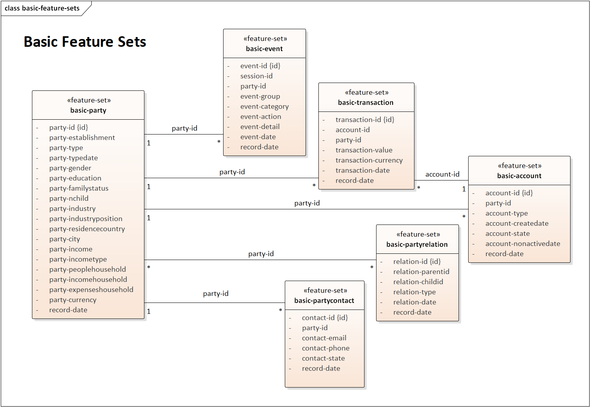

# QGate-Model
The sample machine learning (feature store) model, part of the quality gateway concept. 
This model is independent of machine learning solutions (definition in json, data in csv).

It can be used with various of ML/MLOps solutions with or without FeatureStore.

## Usage
The model is suitable for:
 - compare capabilities and functions of machine learning solutions (as part of RFP/X and SWOT analysis)
 - independent test new versions of machine learning solutions (with aim to keep quality in time)
 - unit, sanity, smoke, system, reqression, function, acceptance, performance, shadow, ... tests
 - external test coverage (in case, that internal test coverage is not available or weak)
 - etc.

## Structure
The solution contains this simple structure:
 - **00-high-level**
   - The high-level [view](./00-high-level/basic-feature-sets.png) to the model for better understanding
   - Note: The HL model is drawn in Enterprise Architect (from Sparx) 
 - **01-model**
   - The definition contains 01-projects, 02-feature sets, 03-feature vectors, etc. in JSON format
 - **02-data**
   - The data for model in CSV/GZ format (future support parquet) for party, account, transaction, etc.
   - Note: 
     - All data is synthetic include personal data (PII, SPII, etc.)
     - You can also generate your own data set with specific size

Addition detail, [see](./docs/README.md)

## Model

